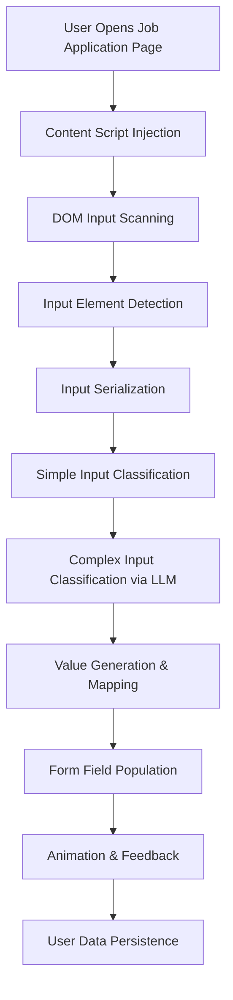

# Chrome Extension Autofill Pipeline - Detailed Technical Analysis

## Pipeline Architecture Overview

The Perfectify chrome extension implements a sophisticated multi-stage autofill pipeline that processes web form inputs and automatically fills them with user data. The system combines rule-based input classification with AI-powered value generation to achieve comprehensive form filling capabilities.

### Core Pipeline Flow



## Phase 1: Content Script Initialization

### Entry Point: `content.tsx`

The autofill pipeline begins when the content script is injected into job application pages. The extension uses a dual-initialization approach:

1. **Top Frame Initialization**: Full React app with sidebar UI for the main page
2. **Iframe Initialization**: Lightweight wrapper for nested iframe content

```typescript
// Key initialization logic
if (isTopFrame) {
  initializeFullApp() // Full sidebar with React/Mantine UI
} else {
  initializeIframeWrapper() // Minimal iframe autofill handler
}
```

### Shadow DOM Isolation

The extension creates an isolated shadow DOM container to prevent styling conflicts:

```typescript
const host = document.createElement('div')
host.id = HOST_ELEMENT_ID
document.body.appendChild(host)
const shadowRoot = host.attachShadow({ mode: 'open' })
```

## Phase 2: Input Detection and Monitoring

### Dynamic Input Discovery: `useInputElements.tsx`

The system continuously monitors the page for form inputs using a sophisticated detection mechanism:

```typescript
const useInputElements = () => {
  const [inputElements, setInputElements] = useState<ElementInfo[]>([])
  
  const findInputElements = useCallback(() => {
    const elements = document.querySelectorAll('input, select, textarea')
    // Filter and process valid form inputs
    return processedElements
  }, [])
}
```

### Input State Tracking: `useWatchInputs.tsx`

For each detected input, the system tracks detailed state information:

```typescript
interface InputState {
  element: WatchableInputElement
  wasEmpty: boolean
  currentValue: string
  hasFocus: boolean
  hasBeenInteractedWith: boolean
  isReactSelect: boolean  // Special handling for React Select components
  valueContainer?: Element | null
}
```

### Input Validation and Filtering

The system applies multiple filters to ensure only meaningful inputs are processed:

- **Accessibility filters**: Excludes disabled and hidden elements
- **Security filters**: Excludes captcha and password fields
- **Type filters**: Prioritizes text, select, checkbox, and radio inputs
- **Context filters**: Uses label detection to identify relevant fields

## Phase 3: Input Serialization and Data Extraction

### SerializableInput Creation: `input.ts`

Each detected DOM element is converted into a standardized `InputElement` object:

```typescript
class InputElement {
  readonly label: string | null           // Extracted field label
  readonly elementReferenceId: string     // Unique identifier for DOM matching
  readonly wholeQuestionLabel: string | null  // Full question context
  readonly fieldType: InputElementType    // Normalized input type
  readonly name: string                   // HTML name attribute
  
  get isLLMAutofillable(): boolean {
    return this.isTextInput || this.isCheckable || this.isSelectInput
  }
}
```

### Advanced Label Extraction: `getLabelText.ts`

The system uses sophisticated label detection to understand input context:

1. **Direct label association**: `<label for="input-id">` relationships
2. **Ancestor scanning**: Parent elements with label-like text
3. **Sibling analysis**: Adjacent text nodes and elements  
4. **Placeholder fallback**: Input placeholder text as context
5. **Accessibility attributes**: ARIA labels and descriptions

### Input Type Classification

The system normalizes HTML input types into a standardized schema:

```typescript
export const INPUT_ELEMENT_TYPES = {
  TEXT: 'text',
  SELECT: 'select', 
  TEXTBOX: 'textbox',
  EMAIL: 'email',
  TEL: 'tel',
  RADIO: 'radio',
  CHECKBOX: 'checkbox',
  // ... additional types
} as const
```

## Phase 4: Two-Stage Input Classification

### Stage 1: Simple Input Classification

The system first attempts to classify inputs using rule-based pattern matching:

```typescript
const categorizeSimpleInputs = (inputs: SerializableInputArray): CategorizedInput[] => {
  return inputs.map((input) => {
    let category: SimpleInputsEnum = 'unknown'
    if (isNameInput(input)) category = 'name'
    else if (isEmailInput(input)) category = 'email'
    else if (isPronounsInput(input)) category = 'pronouns'
    // ... additional pattern matching
    return { element: input, category }
  })
}
```

**Simple Classification Categories**:
- `name`: First name, last name, full name fields
- `email`: Email address inputs
- `pronouns`: Gender pronoun selections
- `linkedin_profile`: LinkedIn URL inputs
- `github_url`: GitHub profile links
- `resume_upload`: File upload fields for resumes

### Stage 2: Complex Input Classification via Backend

Inputs not classified by simple rules are sent to the backend for AI-powered classification:

```typescript
const complexInputsInstructions = await triggerGetAutofillValues(complexInputs)
```

## Phase 5: Backend Processing Pipeline

### Request Handling: `request_handler.py`

The backend receives minified input data and processes it through multiple stages:

```python
@functions_framework.http
def get_input_autofill_instructions(request):
    inputs = parse_inputs(request)
    autofill_instructions = fill_inputs(inputs, user_id)
    return {"autofill_instructions": autofill_instructions}
```

### Input Embedding and Classification: `embeddings.py`

The system uses Google's Text Embedding 004 model for semantic classification:

1. **Prototype Embeddings**: Pre-computed embeddings for 35+ input categories
2. **Real-time Embedding**: Input labels are embedded using the same model
3. **Similarity Matching**: Cosine similarity determines best category match
4. **Confidence Filtering**: Only matches above 0.75 threshold are accepted

```python
def classify_inputs_with_embeddings(inputs: List[MinifiedInput]) -> List[ClassifiedInput]:
    # Batch process inputs for efficiency (50 per batch)
    input_texts = extract_classification_texts(inputs)
    embeddings = get_embeddings(input_texts, model="text-embedding-004")
    
    classified = []
    for embedding, input_data in zip(embeddings, inputs):
        best_category = find_best_match(embedding, prototype_embeddings)
        if best_category.confidence > 0.75:
            classified.append(ClassifiedInput(input_data, best_category))
    
    return classified
```

### Category-Specific Value Generation

Each input category has a dedicated handler that maps classified inputs to user data:

```python
# Example: Name Category Handler
class NameCategoryHandler(BaseCategoryHandler):
    def handle(self, input_item: ClassifiedInput, user_data: UserData) -> AutofillInstruction:
        if input_item.subcategory == "first_name":
            return AutofillInstruction(
                input_id=input_item.id,
                value=user_data.name.first_name
            )
        elif input_item.subcategory == "last_name":
            return AutofillInstruction(
                input_id=input_item.id, 
                value=user_data.name.last_name
            )
```

### Comprehensive Category Coverage

The system handles 35+ input categories across multiple domains:

**Personal Information**:
- Name fields (first, last, full)
- Contact information (email, phone)
- Location data (address, city, state, country, postal code)

**Professional Data**:
- Social profiles (LinkedIn, GitHub, personal websites)
- Current employment details
- Education information (school, degree, discipline, dates)

**Demographics & Identity**:
- Gender identity and pronouns
- Race and ethnicity preferences
- Veteran and disability status
- Sexual orientation (where legally required)
- Transgender status

**Work Authorization**:
- US work authorization status
- Visa sponsorship requirements
- International work eligibility

## Phase 6: Value Filling and DOM Manipulation

### Instruction Processing: `autofillInputElements.ts`

The frontend receives autofill instructions and maps them back to DOM elements:

```typescript
const fillElementWithInstructionValue = async (instruction: AutofillReadyInputElement) => {
  const element = getElementByReferenceId(instruction.elementReferenceId)
  if (!element) return

  const autofillValue = instruction.autofillValue
  if (isSelectLikeElement(element)) {
    await fillSelectLikeElement(element, autofillValue, instruction.label)
  } else if (element instanceof HTMLTextAreaElement) {
    fillTextAreaElement(element, autofillValue)
  } else if (isRadioOrCheckbox(element)) {
    fillRadioOrCheckboxElement(element, autofillValue)
  }
}
```

### Advanced Select Element Handling: `selectMatching.ts`

The system implements sophisticated select option matching using fuzzy search:

```typescript
function findBestOptionMatch(
  options: SelectOption[],
  value: string,
  maxScore = 0.5,
): SelectOption | null {
  const fuse = new Fuse(options, {
    keys: ['label'],
    threshold: 0.4,
    ignoreLocation: true,
    includeScore: true,
  })
  
  // Match against multiple synonyms with negation handling
  const synonymsStrings = value.toLowerCase().split('|').map(s => s.trim())
  // ... fuzzy matching logic
}
```

### Custom Component Support

The system handles modern web form libraries:

- **React Select**: Detects and interacts with React Select components
- **Custom dropdowns**: Handles ARIA-compliant custom select elements
- **Multi-step forms**: Manages form state across page transitions

### Value Type Handling

Different input types receive specialized treatment:

```typescript
// Text inputs: Direct value insertion with event simulation
const fillTextInputElement = (input: HTMLInputElement, value: string) => {
  input.value = value
  input.dispatchEvent(new Event('input', { bubbles: true }))
  input.dispatchEvent(new Event('change', { bubbles: true }))
}

// Boolean inputs: State management for checkboxes and radios
const fillRadioOrCheckboxElement = (input: HTMLInputElement, value: boolean) => {
  input.checked = value
  input.dispatchEvent(new Event('change', { bubbles: true }))
}

// File inputs: Resume upload handling
const fillResumeUploadInput = async (element: HTMLInputElement, fileName: string) => {
  // Complex file upload simulation
}
```

## Phase 7: Animation and User Feedback

### Visual Feedback System: `animateInputFilling.ts`

The system provides smooth visual feedback during autofill:

```typescript
export const AutofillAnimationSpeeds = {
  NONE: 0,
  FAST: 200,
  SLOW: 500,
}

const triggerPulseAnimation = (element: HTMLElement) => {
  element.style.animation = 'perfectify-pulse 0.6s ease-in-out'
  // Custom CSS animation for visual feedback
}
```

### Scroll Management

The system intelligently scrolls to show autofill progress:

```typescript
const asyncScrollToElement = async (element: HTMLElement) => {
  element.scrollIntoView({ 
    behavior: 'smooth', 
    block: 'center' 
  })
  await new Promise(resolve => setTimeout(resolve, 300))
}
```

## Phase 8: Error Handling and Recovery

### Frontend Error Recovery

The system includes comprehensive error handling:

```typescript
try {
  const validatedData = AutofillInstructionsSchema.parse(instructions)
  return validatedData
} catch (error) {
  console.error('Validation error in autofill instructions:', error)
  // Graceful fallback behavior
  throw error
}
```

### Backend Validation

All data is validated using Pydantic schemas:

```python
class AutofillInstruction(BaseModel):
    input_text: Optional[str] = None
    value: Union[str, bool]
    input_id: str
    
    @validator('value')
    def validate_value(cls, v):
        if isinstance(v, str) and len(v.strip()) == 0:
            return None
        return v
```

## Phase 9: Data Persistence and Learning

### User Data Updates: `saveFilledInputs.ts`

The system learns from user interactions by saving manually filled values:

```typescript
const executeSaveFilledValues = async () => {
  const elements = elementsRef.current
  const filledInputs = elements.filter((el) => el.isLLMAutofillable)
  await triggerSaveFilledValues(filledInputs)
}
```

### Incremental Learning

User-filled data is processed and integrated into their profile:

```python
def save_filled_inputs(inputs: List[MinifiedInput], user_id: str):
    classified_inputs = classify_inputs_with_embeddings(inputs)
    for classified_input in classified_inputs:
        handler = get_handler(classified_input.category)
        handler.save_user_data(classified_input, user_id)
```

## Advanced Features

### Iframe Support

The system handles complex application forms across multiple iframes:

```typescript
const sendMessageToIframes = async (eventType: string, data?: any) => {
  const frames = Array.from(document.querySelectorAll('iframe'))
  frames.forEach(frame => {
    frame.contentWindow?.postMessage({ type: eventType, data }, '*')
  })
}
```

### Resume Upload Integration

Specialized handling for resume file uploads:

```typescript
const fillResumeUploadInput = async (element: HTMLInputElement, resumeName: string) => {
  const resumeFile = await fetchResumeFile(resumeName)
  const fileInput = element.querySelector('input[type="file"]')
  await uploadFileToInput(fileInput, resumeFile)
}
```

### Free Response Detection

The system identifies essay questions and text areas requiring custom responses:

```typescript
// Detects free response inputs for later AI generation
const freeResponseInputs = instructions.getFreeResponseAutofills()
```

## Performance Optimizations

### Batch Processing

Both frontend and backend use batch processing for efficiency:

- **Frontend**: Groups API calls to reduce network overhead
- **Backend**: Processes embeddings in batches of 50

### Caching Strategies

- **Prototype embeddings**: Cached in Google Cloud Storage
- **User data**: Cached in Firebase Realtime Database
- **DOM queries**: Memoized to reduce repeated scanning

### Memory Management

- **Shadow DOM isolation**: Prevents memory leaks in host page
- **Event listener cleanup**: Proper removal on component unmount
- **Weak references**: For DOM element tracking

## Security Considerations

### Data Protection

- All user data is encrypted at rest in Firebase
- API communications use HTTPS exclusively
- No sensitive data is logged or cached locally

### Extension Permissions

Minimal required permissions:
- `activeTab`: Access to current tab content only
- `storage`: Local settings persistence
- `scripting`: Dynamic content script injection
- `<all_urls>`: Required for job site compatibility

### Content Security Policy

The extension operates within strict CSP constraints:
- No eval() or unsafe inline scripts
- All external resources loaded securely
- Shadow DOM prevents host page interference

## Error Scenarios and Recovery

### Classification Failures

When input classification fails:
1. **Simple fallback**: Attempts rule-based classification
2. **Manual intervention**: Presents options to user
3. **Unknown handling**: Graceful skipping of unrecognized inputs

### Network Failures

For API communication issues:
1. **Retry logic**: Exponential backoff for temporary failures
2. **Offline mode**: Local processing where possible
3. **User notification**: Clear feedback about service status

### DOM Changes

For dynamic page updates:
1. **MutationObserver**: Monitors DOM changes
2. **Re-scanning**: Detects new form inputs automatically
3. **State persistence**: Maintains autofill state across changes

## Input Processing Methods in Detail

### How Inputs Get Detected

1. **Initial Scan**: On page load, the system queries for `input, select, textarea` elements
2. **Filtering**: Elements are filtered based on type, visibility, and relevance
3. **Reference ID Assignment**: Each element receives a unique `data-autofill-id` attribute
4. **Continuous Monitoring**: MutationObserver watches for new elements

### How Labels Are Extracted

The `getLabelText.ts` system uses a hierarchical approach:

```typescript
export const getLabelText = (element: ElementInfo): string | null => {
  // 1. Try direct label association
  const directLabel = getDirectLabelText(element)
  if (directLabel) return directLabel
  
  // 2. Look for parent labels
  const parentLabel = getParentLabelText(element)
  if (parentLabel) return parentLabel
  
  // 3. Check sibling elements
  const siblingLabel = getSiblingLabelText(element)
  if (siblingLabel) return siblingLabel
  
  // 4. Use placeholder as fallback
  return element.placeholder || null
}
```

### How Values Get Matched

The classification system works through multiple stages:

1. **Text Extraction**: Combines label, name, placeholder, and context
2. **Embedding Generation**: Converts text to 768-dimensional vectors
3. **Similarity Calculation**: Compares against 35+ prototype embeddings
4. **Confidence Scoring**: Applies thresholds and field type adjustments
5. **Category Assignment**: Maps to specific handler based on best match

### How Forms Get Filled

The filling process follows a strict sequence:

1. **Element Resolution**: Maps instruction IDs back to DOM elements
2. **Type Detection**: Determines the appropriate filling method
3. **Value Application**: Uses specialized handlers for each input type
4. **Event Simulation**: Triggers proper DOM events for framework compatibility
5. **Animation**: Provides visual feedback during the process

This comprehensive autofill pipeline represents a sophisticated form automation system that balances accuracy, performance, and user experience while handling the complexity of modern web applications and diverse job application forms.